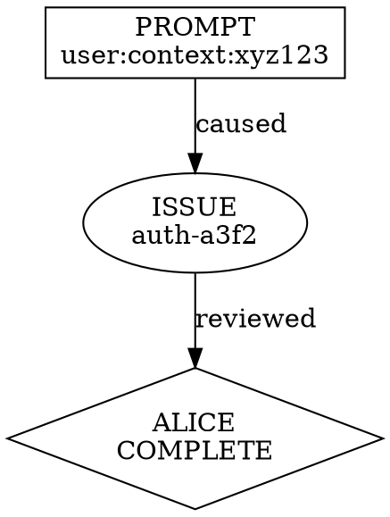

# Conversation Trace Design

**Status:** Draft
**Author:** Claude (with alice review)
**Date:** 2026-01-04

## Problem Statement

The idle system creates diffuse state across `tissue` (issues) and `jwz` (messages) during agent sessions. Users cannot easily see:

1. What state was created during a session
2. Causal relationships between events (what caused what)
3. Cross-session continuity (how issues evolve across sessions)

**Goal:** Enable users to generate a "conversation trace" that shows causal flow through tissue and jwz state.

## Current State

### Existing Schema

**Tissue Issue:**
```zig
pub const Issue = struct {
    id: []const u8,           // PREFIX-HASH format
    title: []const u8,
    body: []const u8,
    status: []const u8,       // open, in_progress, paused, duplicate, closed
    priority: i32,            // 1-5 (1=highest)
    created_at: i64,          // ms since epoch
    updated_at: i64,
    rev: []const u8,          // ULID for conflict resolution
    tags: []const []const u8,
    // NO session linkage
};
```

**Jwz Message:**
```zig
pub const Message = struct {
    id: []const u8,           // ULID
    topic_id: []const u8,
    parent_id: ?[]const u8,   // Threading support
    body: []const u8,
    created_at: i64,
    reply_count: i32,
    sender: ?Sender,          // Optional identity
    git: ?GitMeta,            // Optional git context
};

pub const Sender = struct {
    id: []const u8,           // Can be session ID
    name: []const u8,
    model: ?[]const u8,
    role: ?[]const u8,
};
```

### Existing Session Linkage

Session ID flows from Claude Code runtime through hooks:

| Topic Pattern | Purpose | Created By |
|---------------|---------|------------|
| `user:context:{session}` | User's original prompt | UserPromptSubmit hook |
| `review:state:{session}` | Review gate enabled/disabled | UserPromptSubmit hook |
| `alice:status:{session}` | Alice's decision | Alice agent |

**Gap:** Tissue issues have NO session linkage. Alice posts issue IDs in message body (informal).

## Design Options Considered

### Option A: Add session_id to tissue issues

Add `origin_session_id: ?[]const u8` field to Issue struct.

| Pros | Cons |
|------|------|
| Direct linkage, easy to query | Requires tissue schema change |
| Backward compatible (optional field) | Agents must remember to pass it |
| Pointer, not payload | Issues outlive sessions |

### Option B: Meta-trace topic in jwz

Create `trace:{session_id}` topic logging all events.

| Pros | Cons |
|------|------|
| No schema changes to tissue | Duplication of events |
| Single topic for full trace | Agents must remember to log |
| Includes cross-store events | Sync risk |

### Option C: Timestamp reconstruction

Query both stores by time range, merge by timestamp.

| Pros | Cons |
|------|------|
| No schema changes | **ULID clock skew causes wrong joins** |
| No logging burden | **Millisecond ambiguity** |
| Works retroactively | **Non-reproducible traces** |
| | **Causality loss** (time != causation) |
| | DoS risk (wide scans) |

**Alice verdict:** Option C rejected as primary mechanism. "Safety over policy" requires deterministic traces.

### Option D: Hybrid A + C

Add session_id to tissue, use reconstruction as fallback.

| Pros | Cons |
|------|------|
| Graceful degradation | Complexity |
| Best of both | Schema change still required |

## Recommended Approach: Option E (Synthesized)

Combine explicit pointers with mechanical trace generation.

### Schema Changes

**1. Tissue Issue (additive)**

```zig
pub const Issue = struct {
    // ... existing fields ...
    origin_session_id: ?[]const u8,  // NEW: Session that created this
};
```

**2. Tissue CLI**

```bash
tissue new "Bug found" --session xyz123
```

### Topic Patterns

**3. Session touch events**

When a session modifies an issue, post to `issue:{issue_id}`:

```json
{
  "type": "session_touch",
  "session_id": "xyz123",
  "action": "created|commented|status_changed",
  "timestamp": 1704326400000,
  "event_id": "01HQ5N3XYZ..."
}
```

**Deduplication:** Include `event_id` (ULID) to prevent duplicate events. Consumers dedupe by `(session_id, action, event_id)`.

**Retention:** Session touch events follow jwz message retention (indefinite in JSONL). For high-activity issues, consider:
- Compaction: Collapse repeated touches from same session into summary
- Archival: Move old touches to `issue:{id}:archive` topic after N days

**TODO - Compaction policy (deferred):**
- Compaction is out of scope for initial implementation
- Invariant: Original event_ids must be preserved in compacted record for auditability
- Invariant: Compaction must be idempotent (running twice produces same result)
- Design compaction when usage patterns are better understood

**4. Hook-generated trace topic**

`trace:{session_id}` - populated mechanically by hooks, NOT by agents:

```json
{"type": "prompt_received", "timestamp": 1704326400000}
{"type": "issue_created", "issue_id": "auth-a3f2", "timestamp": 1704326401000}
{"type": "alice_invoked", "timestamp": 1704326500000}
{"type": "alice_decision", "decision": "COMPLETE", "issues": ["auth-a3f2"], "timestamp": 1704326600000}
```

### Sender Identity Stamping

**Problem:** Using `--as session:{id}` overwrites actor identity. A message from "alice" would lose that attribution.

**Current limitation:** The `--as` flag sets `sender.id`, which is expected to be a ULID for name generation (`zawinski/src/names.zig`). Non-ULID values will produce incorrect derived names.

**Workaround (immediate, no code changes):**

Use `--role` for actor identity, include session in message body:

```bash
jwz post "research:auth" --role alice -m '[session:xyz123] Research findings...'
```

Query by actor role: `jwz read "research:auth" --json | jq '.[] | select(.sender.role == "alice")'`
Query by session: `jwz search "session:xyz123"`

**Future enhancement (requires zawinski changes):**

Add explicit `--session` flag to jwz CLI:
```bash
jwz post "research:auth" --role alice --session xyz123 -m "..."
```

This would store session_id in a dedicated field, separate from sender identity:
```json
{
  "sender": {"id": "<ULID>", "role": "alice"},
  "session_id": "xyz123"  // NEW FIELD
}
```

**Required changes for future enhancement:**
- `zawinski/src/store.zig`: Add `session_id` to Message struct
- `zawinski/src/sqlite.zig`: Add column + index
- `zawinski/src/main.zig`: Add `--session` CLI flag
- `zawinski/src/main.zig`: Add `--filter-session` to search/read commands

### Cross-Session Continuity

The many-to-many relationship is modeled as:

- `origin_session_id` on tissue: "Which session created this issue?"
- `session_touch` events in `issue:{id}` topic: "Which sessions touched this issue later?"

Query: "What sessions touched issue auth-a3f2?"
```bash
# Session touch events are posted with type in body as JSON
jwz read "issue:auth-a3f2" --json | jq '.[] | select(.body | fromjson? | .type == "session_touch")'
```

Query: "What issues were created in session xyz123?"
```bash
tissue list --session xyz123  # Requires Phase 2 implementation
```

**Note:** The `tissue list --session` flag requires Phase 2 implementation. Until then, use:
```bash
# Search for session marker in issue body (quote the term to avoid FTS5 column syntax)
tissue list --search '"session:xyz123"'
```

**Caveat:** Tissue FTS5 does not sanitize queries like jwz does. Unquoted colons are interpreted as column specifiers. Always wrap session markers in double quotes.

## Implementation Phases

### Phase 1: Session markers in message body (immediate, no code changes)

Start including session markers in jwz message bodies:

```bash
jwz post "research:auth" --role alice -m '[session:xyz123] Research findings...'
```

This provides immediate traceability via FTS search: `jwz search "session:xyz123"`

**Limitation:** Session is in body text, not structured field. Queries are string-based, not indexed.

**Files:** Hook scripts and agent conventions only

### Phase 1.5: Zawinski session_id field (optional, enables Phase 4)

Add `session_id` to jwz Message struct for structured session tracking.

**Files:**
- `zawinski/src/store.zig` - Add `session_id: ?[]const u8` to Message struct + JSONL serialization
- `zawinski/src/sqlite.zig` - Add column + index `idx_messages_session`
- `zawinski/src/main.zig` - Add `--session` flag to `post` command
- `zawinski/src/main.zig` - Add `--filter-session` to `search`/`read` commands

**Note:** Phase 1.5 is optional but significantly improves Phase 4 trace query performance.

### Phase 2: Tissue origin_session_id

Add optional field to tissue schema and CLI.

**Files:**
- `tissue/src/store.zig` - Add `origin_session_id: ?[]const u8` to Issue struct + JSONL serialization
- `tissue/src/sqlite.zig` - Add column to schema
- `tissue/src/main.zig` - Add `--session` flag to `new` command
- `tissue/src/main.zig` - Add `--session` filter to `list` command

### Phase 3: Hook-generated trace topic

Modify hooks to emit events to `trace:{session_id}`:

**Files:**
- `idle/hooks/user-prompt-hook.sh` - Emit `prompt_received`
- `idle/hooks/stop-hook.sh` - Emit `alice_decision` when detected

### Phase 4: Trace query command

Add `jwz trace` subcommand:

```bash
jwz trace xyz123              # Show full session trace
jwz trace xyz123 --issues     # Filter to issue events
jwz trace xyz123 --format dot # Export as GraphViz DAG
```

**Files:**
- `zawinski/src/main.zig` - Add trace subcommand
- `zawinski/src/trace.zig` - Trace reconstruction logic

## Open Questions

### 1. Retention Policy

How long do traces persist? Options:
- Same as jwz message retention (indefinite in JSONL)
- Time-bounded (e.g., 90 days)
- Session-bounded (delete when session explicitly closed)

**Recommendation:** Indefinite by default, matching existing jwz behavior.

### 2. Purpose: Debugging vs Accountability

| If debugging convenience | If safety accountability |
|--------------------------|-------------------------|
| Ephemeral reconstruction OK | Traces must be persistent |
| Approximate causality OK | Explicit pointers required |
| Best-effort is fine | Deterministic required |

**Recommendation:** Design for accountability (stricter), degrade to debugging use case.

### 3. Visualization Format

Options:
- Text-based trace (simple, immediate)
- GraphViz DAG export (visual, requires external tool)
- Interactive HTML (rich, more implementation)

**Recommendation:** Start with text + GraphViz export. Defer interactive.

### 4. Session Boundaries

What defines session start/end?
- Start: First message in `user:context:{session}` OR first event in `trace:{session}`
- End: Multiple options depending on context

**General boundary rules (not alice-specific):**

| Signal | Meaning |
|--------|---------|
| `trace:{session}` contains `session_end` event | Explicit close |
| No activity in session for N minutes | Timeout (configurable, default 30min) |
| Claude Code process exits | Implicit close |
| Alice decision `COMPLETE` | Natural checkpoint (idle-specific) |

**Recommendation:** Sessions are "open" until explicitly closed or timed out. Alice COMPLETE is a checkpoint within a session, not necessarily the end.

## Causality Determination

The GraphViz format shows "caused" edges. Causality is determined **mechanically**, not heuristically:

### Explicit Causality (reliable)

| Event A | Event B | Causality Rule |
|---------|---------|----------------|
| `prompt_received` | `issue_created` | B has same session_id AND B.timestamp > A.timestamp |
| `issue_created` | `alice_decision` | Issue ID appears in alice's `issues` array (explicit reference) |
| `session_touch` on issue X | `status_changed` on X | Same session_id AND touch.timestamp < change.timestamp |

**Pairing algorithm for "same session after A":**
1. Query all events with matching session_id
2. Sort by timestamp (ULID natural order)
3. For event B, find most recent event A of expected type where A.timestamp < B.timestamp
4. If A exists and is in same session, create edge A → B

### Inferred Causality (approximate)

When explicit links are unavailable (legacy data), infer from:
1. Same session + temporal order (A before B in same session)
2. Reference in message body (issue ID mentioned in text)

Inferred edges are marked in output:
```dot
prompt -> issue_auth [label="caused" style=dashed];  // inferred
issue_auth -> alice [label="reviewed" style=solid];  // explicit
```

### Non-Causality

These do NOT imply causation:
- Same timestamp (could be coincidence)
- Same topic but different sessions
- Similar content (semantic similarity ≠ causation)

## Trace Output Format

### Text Format (default)

```
=== Session xyz123 ===
Started: 2026-01-04T10:00:00Z

[10:00:00] PROMPT user:context:xyz123
           "Help me design a conversation trace feature"

[10:00:15] ISSUE_CREATED auth-a3f2
           "Missing error handling in auth flow"
           Tags: alice-review

[10:05:00] ALICE_INVOKED

[10:05:30] ALICE_DECISION COMPLETE
           Issues: [auth-a3f2]
           Summary: "Design exploration complete, proposal created"

=== End Session ===
```

### GraphViz Format (--format dot)



## Backward Compatibility

- Tissue issues without `origin_session_id`: Treated as "unknown session"
- Sessions without `trace:{session}` topic: Fall back to timestamp heuristic
- Old jwz messages without sender identity: No session attribution

Existing data remains valid. New features degrade gracefully.

### Migration Plan

**Phase 2 (tissue schema change):**

1. Add `origin_session_id` column as NULLABLE to SQLite schema
2. JSONL format: New field optional, missing = null
3. CLI: `--session` flag optional, omission = null
4. Query: `tissue list --session xyz` returns only issues with explicit session
5. Query: `tissue list --session unknown` returns issues without session linkage

**Consumer contract:**
- Existing tissue consumers see no change (field is optional)
- New consumers can query by session
- No breaking changes to existing integrations

**Rollback:** Drop column, ignore field in JSONL (forward-compatible format)

## Security Considerations

- Session IDs are UUIDs, not secrets - no confidentiality concern
- Trace topics are readable by any agent in the project - matches existing jwz model
- No cross-project leakage - traces scoped to jwz store

### Trust & Spoofability

**Threat:** The `--as` flag is user/agent-controlled. Session IDs can be spoofed.

**Impact by use case:**

| Use Case | Impact of Spoofing | Mitigation |
|----------|-------------------|------------|
| Debugging | Low - developer would only confuse themselves | None needed |
| Incident review | Medium - false attribution possible | Hook-generated events are trusted |
| Audit/compliance | High - unacceptable | Requires signed events (future) |

**Current mitigation:**
- Hook-generated events in `trace:{session}` are trustworthy (hooks run in Claude Code runtime, not agent-controlled)
- Agent-posted messages to `issue:{id}` are attributable but not verified

**Future mitigation (if audit required):**
- Sign trace events with session-specific key
- Store session keys in secure enclave
- Out of scope for initial implementation

## Dependencies

- Tissue schema change (Phase 2) - requires tissue release
- Hook changes (Phase 3) - requires idle release
- jwz trace command (Phase 4) - requires zawinski release

Phases can be implemented independently and released incrementally.
